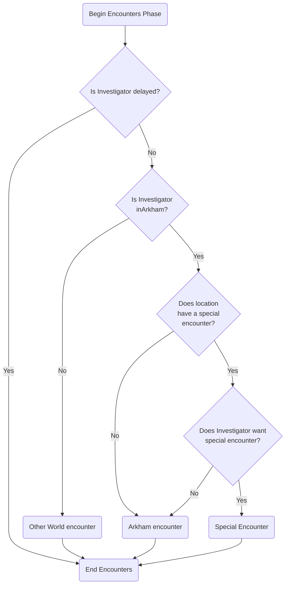

```mermaid
flowchart TD
    beginning(Begin Encounters Phase)
        --> delayed{Is Investigator delayed?}
            --> |Yes| ending(End Encounters)
        delayed
            --> |No| in_arkham{Is Investigator\ninArkham?}
                --> |No| other_world_encounter(Other World encounter)
                --> ending
        in_arkham
            --> |Yes| has_special{Does location \nhave a special \nencounter?}
                --> |No| arkham_encounter(Arkham encounter)
                -->ending
            has_special
                --> |Yes| wants_special{Does Investigator want\nspecial encounter?}
                    --> |No| arkham_encounter
                wants_special
                    --> |Yes| special_encounter(Special Encounter)
                    --> ending
```