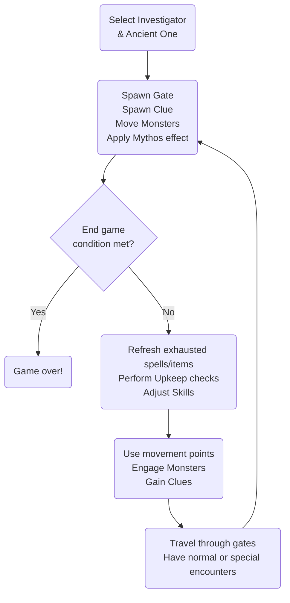

```mermaid
flowchart TD
    setup(Select Investigator\n& Ancient One)
        --> mythos(Spawn Gate\nSpawn Clue\nMove Monsters\nApply Mythos effect)
        --> end_game_condition{End game\ncondition met?}
            --> |Yes| game_over(Game over!)
        end_game_condition 
            --> |No| upkeep(Refresh exhausted spells/items\nPerform Upkeep checks\nAdjust Skills)
            --> movement(Use movement points\nEngage Monsters\nGain Clues)
            --> encounters(Travel through gates\nHave normal or special encounters)
            --> mythos
```