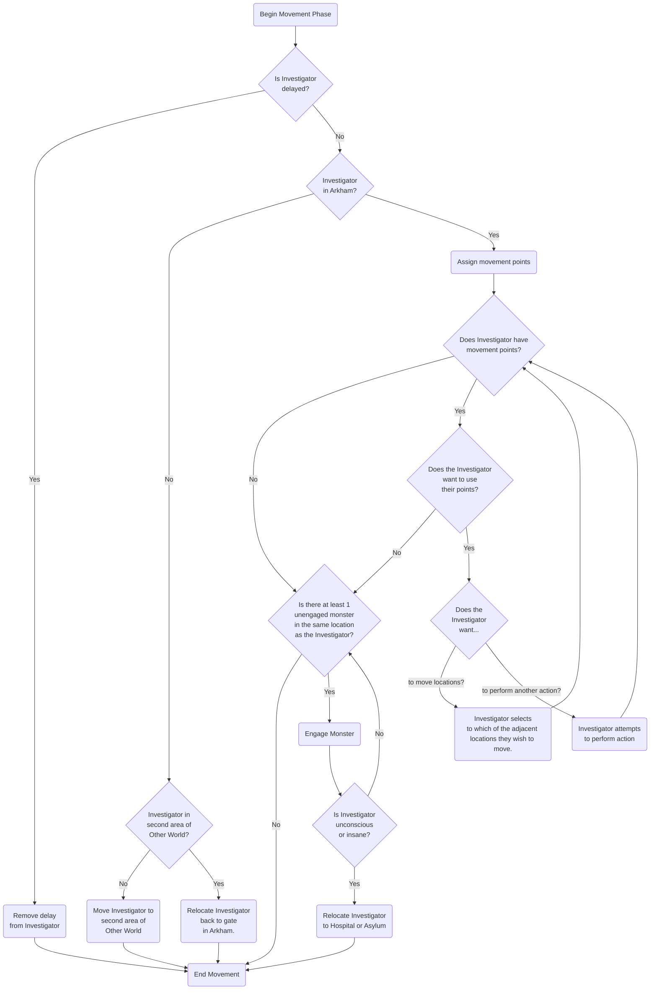

```mermaid
flowchart TD
    beginning(Begin Movement Phase)
        --> delayed{Is Investigator\ndelayed?}
            --> |Yes| stand_up(Remove delay\nfrom Investigator)
            --> ending(End Movement)
        delayed
            --> |No| in_arkham{Investigator\nin Arkham?}
                --> |No| on_level_2{Investigator in\nsecond area of\nOther World?}
                    --> |No| level_2(Move Investigator to\nsecond area of\nOther World)
                        --> ending
                on_level_2 
                    --> |Yes| back_to_arkham(Relocate Investigator\nback to gate\nin Arkham.)
                    --> ending
            in_arkham
                --> |Yes| mvmt_pts(Assign movement points)
                --> has_mvmt_pts{Does Investigator have\nmovement points?}
                    --> |No| check_monsters{Is there at least 1\nunengaged monster\nin the same location\nas the Investigator?}
                        --> |No| ending
                    check_monsters
                        --> |Yes| monster(Engage Monster)
                        --> knockout{Is Investigator\nunconscious\nor insane?}
                            --> |No| check_monsters
                        knockout
                            --> |Yes| ambulance(Relocate Investigator\nto Hospital or Asylum)
                            --> ending
                has_mvmt_pts
                    --> |Yes| want_to_use_pts{Does the Investigator\nwant to use\ntheir points? }
                        --> |No| check_monsters
                    want_to_use_pts
                        --> |Yes| action{Does the\nInvestigator\nwant...}
                            --> |to move locations?| adjacent(Investigator selects\nto which of the adjacent \nlocations they wish to move.)
                            --> has_mvmt_pts
                        action
                            --> |to perform another action?| spell(Investigator attempts\nto perform action)
                            --> has_mvmt_pts
            

```