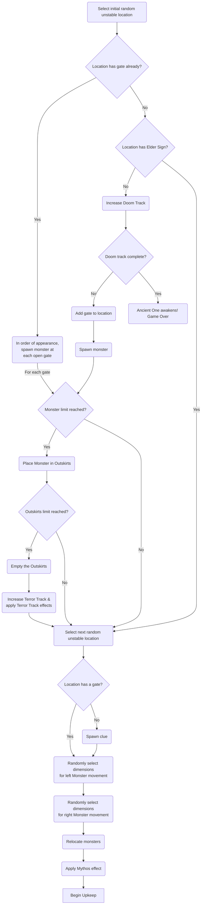

```mermaid
flowchart TD
    select_location_0(Select initial random unstable location)
        --> has_gate_0{Location has gate already?}
            --> |Yes| monster_surge(In order of appearance,\nspawn monster at\neach open gate)
            --> |For each gate| monster_limit{Monster limit reached?}
                --> |Yes| outskirts(Place Monster in Outskirts)
                --> outskirts_limit{Outskirts limit reached?}
                    --> |Yes| empty_outskirts(Empty the Outskirts)
                    --> terror_track(Increase Terror Track &\napply Terror Track effects)
                    --> select_location_1(Select next random unstable location)
                    --> has_gate_1{Location has a gate?}
                        --> |Yes| select_dimensions_left(Randomly select dimensions\nfor left Monster movement)
                        --> select_dimensions_right(Randomly select dimensions\nfor right Monster movement)
                        --> move_monsters(Relocate monsters)
                        --> mythos_effect(Apply Mythos effect)
                        --> upkeep[Begin Upkeep]
        has_gate_0
            --> |No| has_elder_sign{Location has Elder Sign?}
                --> |No| doom_track(Increase Doom Track)
                --> doom_full{Doom track complete?}
                    --> |No| spawn_gate(Add gate to location)
                    --> spawn_monster(Spawn monster)
                    --> monster_limit
                doom_full    
                    --> |Yes| AO_awakens(Ancient One awakens! Game Over)
            monster_limit
                --> |No| select_location_1
                outskirts_limit
                    --> |No| select_location_1
                    has_gate_1
                        --> |No| spawn_clue(Spawn clue)
                        --> select_dimensions_left
            has_elder_sign
                --> |Yes| select_location_1
                
                    
```