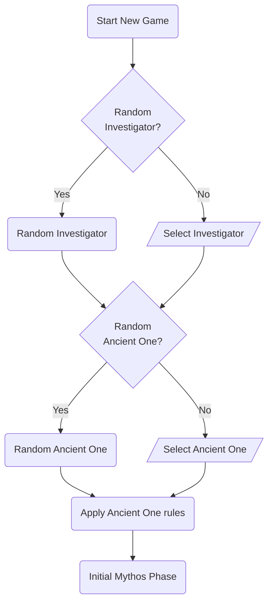

```mermaid
flowchart TD
    start(Start New Game) 
        --> investigator_select{Random\nInvestigator?} 
        --> |Yes| rand_investigator(Random Investigator) 
        --> ancient_one_select{Random\nAncient One?}
        --> |Yes| rand_AO(Random Ancient One)
        --> apply_AO_transforms(Apply Ancient One rules)
        --> E(Initial Mythos Phase)
    investigator_select 
        -->|No| choose_invstigator[/Select Investigator/]
        --> ancient_one_select
    ancient_one_select
        -->|No| choose_AO[/Select Ancient One/]
        --> apply_AO_transforms
```