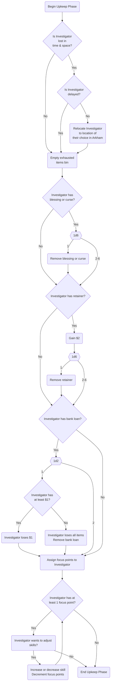

```mermaid
flowchart TD
    beginning(Begin Upkeep Phase)
        --> lost{Is Investigator\nlost in\ntime & space?}
            --> |No| refresh_cards(Empty exhausted\nitems bin)
            --> blessed_cursed{Investigator has\nblessing or curse?}
                --> |No| retainer{Investigator has retainer?}
                    --> |No| bank_loan{Investigator has bank loan?}
            blessed_cursed
                --> |Yes| roll_die_0{{1d6}}
                    --> |1| remove_blessed_curse(Remove blessing or curse)
                    --> retainer 
                roll_die_0
                    --> |2-6| retainer
            retainer
                --> |Yes| gain_payroll(Gain $2)
                --> roll_die_1{{1d6}}
                    --> |1| remove_retainer(Remove retainer)
                    --> bank_loan
                roll_die_1
                --> |2-6| bank_loan
            bank_loan
                --> |Yes| roll_die_2{{1d2}}
                    --> |1| has_enough_money{Investigator has\nat least $1?}
                        --> |Yes| pay_down_loan(Investigator loses $1)
                        --> focus_points
                    has_enough_money
                        --> |No| default_on_loan(Investigator loses all items\nRemove bank loan)
                        --> focus_points
                roll_die_2 
                    --> |2| focus_points
            bank_loan --> |No| focus_points(Assign focus points to Investigator)
                --> has_focus{Investigator has at\nleast 1 focus point?}            
                    --> |Yes| adjust_skills(Investigator wants to adjust skills?)
                        --> |Yes| adjust_skill(Increase or decrease skill\nDecrement focus points)
                        --> has_focus
                    adjust_skills
                        --> |No| ending(End Upkeep Phase)
                has_focus
                    --> |No| ending
        lost
            --> |Yes| delayed{Is Investigator\n delayed?}
                --> |Yes| refresh_cards
            delayed
                --> |No| relocated(Relocate Investigator\nto location of\n their choice in Arkham)
            --> refresh_cards
```