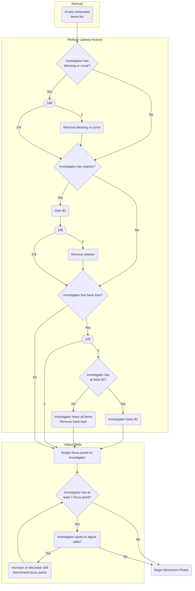

```mermaid
flowchart TD
    subgraph refresh [Refresh]
        refresh_cards(Empty exhausted\nitems bin)
    end
    subgraph upkeep_actions [Perform Upkeep Actions]
        refresh_cards --> blessed_cursed{Investigator has\nblessing or curse?}
            --> |No| retainer{Investigator has retainer?}
                --> |No| bank_loan{Investigator has bank loan?}
        blessed_cursed
            --> |Yes| roll_die_0{{1d6}}
                --> |1| remove_blessed_curse(Remove blessing or curse)
                --> retainer 
            roll_die_0
                --> |2-6| retainer
        retainer
            --> |Yes| gain_payroll(Gain $2)
                --> roll_die_1{{1d6}}
                    --> |1| remove_retainer(Remove retainer)
                    --> bank_loan
            roll_die_1
                --> |2-6| bank_loan
        bank_loan
            --> |Yes| roll_die_2{{1d2}}
                --> |1| has_enough_money{Investigator has\nat least $1?}
                    --> |Yes| pay_down_loan(Investigator loses $1)
                has_enough_money
                    --> |No| default_on_loan(Investigator loses all items\nRemove bank loan)
                    
    end
    subgraph skills [Adjust Skills]
        pay_down_loan & default_on_loan --> focus_points
        roll_die_2 --> |2| focus_points
        bank_loan --> |No| focus_points(Assign focus points to Investigator)
                        --> has_focus{Investigator has at\nleast 1 focus point?}            
        has_focus
            --> |Yes| adjust_skills(Investigator wants to adjust skills?)
                --> |Yes| adjust_skill(Increase or decrease skill\nDecrement focus points)
                --> has_focus
    end
        has_focus & adjust_skills --> |No| movement(Begin Movement Phase)
```